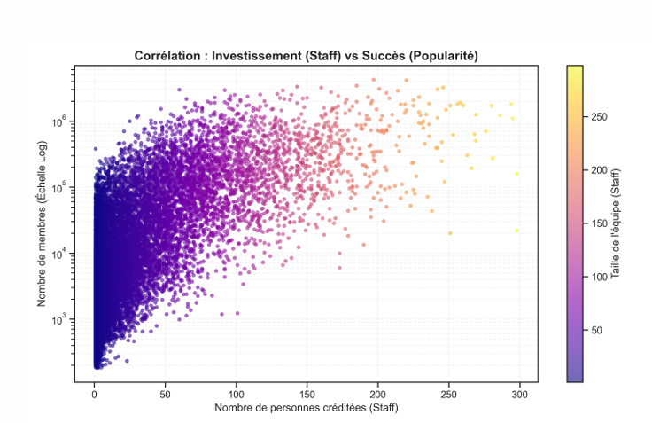
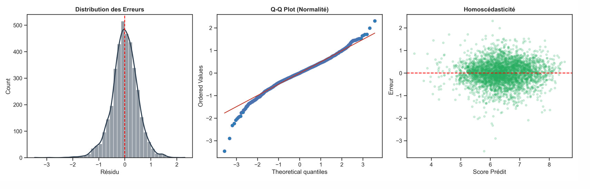
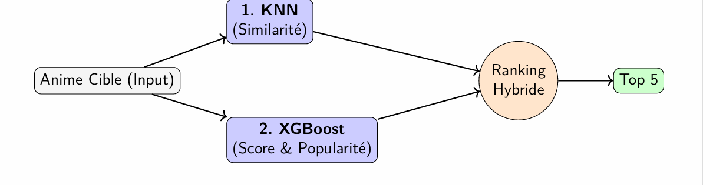

# Anime Success Prediction & Recommendation System
### Modeling Critical and Commercial Success using Machine Learning

> **Authors**: Alexis Schneider & Kelvin Wong  
> **Type**: Supervised Regression & Recommendation System  
> **Tech Stack**: Python, Scikit-learn, XGBoost, Pandas, Matplotlib

---

## Executive Summary
In an industry producing thousands of works annually, predicting success before broadcast is a strategic challenge. This project leverages the **Kaggle Anime Dataset** (relational, 13 CSV files) to:

1.  **Predict Quality (Score)**: Estimating the average user rating (0-10).
2.  **Predict Popularity (Members)**: Estimating commercial reach and community size.
3.  **Recommend**: A hybrid engine combining content similarity with success predictions.

**Key Result:** Our final model (XGBoost) explains **90.3% of the variance** in popularity, significantly outperforming linear baselines.

---

## 1. Dataset Construction & Anti-Leakage Strategy
The main challenge was consolidating heterogeneous data (Staff, Casting, Metadata) while strictly avoiding **Data Leakage**.

### Rigorous Leakage Management
We identified and removed variables that betray the "future" (e.g., *Members*, *Favorites*) or constitute a mathematical leak regarding the target variable.

*Figure 1: Statistical analysis justifying the removal of "post-broadcast" variables (Rank, Members) to prevent artificial overfitting.*

---

## 2. Feature Engineering & Insights
The final matrix ($N=15105, P=122$) relies on an advanced encoding strategy to handle high cardinality (>1200 Studios):

*   **Target Encoding**: Replacing labels (Studios, Voice Actors) with their historical success averages (`studio_avg_score`, `voice_actor_avg`).
*   **Economic Proxies**: Using the size of the technical staff (`n_staff`) as a proxy for production budget.

### Insight: The Impact of Investment
Exploratory analysis confirms that success is not random. There is a clear correlation between technical resources invested and final popularity.

*Figure 2: Relationship between Staff Size (X-Axis) and Popularity (Y-Axis). Note the structural advantage of Manga adaptations (Blue points).*

---

## 3. Modeling: From Linear to Boosting
We compared a Baseline approach (Ridge/Lasso) against Ensemble methods (Random Forest, XGBoost).

### Residual Analysis & Model Selection
Linear models plateaued ($R^2 \approx 60\%$) due to their inability to capture non-linearities (threshold effects). **XGBoost** was selected for its ability to model complex interactions (e.g., *Genre x Studio*).

*Figure 3: Residual analysis of the final model showing a quasi-Gaussian distribution of errors (left) and good homoscedasticity (right), validating statistical robustness.*

### Final Performance

| Model | RMSE (Score) | $R^2$ (Score) | RMSE (Pop) | $R^2$ (Pop) |
| :--- | :---: | :---: | :---: | :---: |
| **Ridge (Baseline)** | 0.5670 | 60.0% | 1.0903 | 80.7% |
| **Random Forest** | 0.5129 | 67.2% | 0.8217 | 89.0% |
| **XGBoost (Final)** | **0.5008** | **68.8%** | **0.7719** | **90.3%** |

---

## 4. Application: Hybrid Recommendation
Beyond prediction, we implemented a recommendation system to solve the "discoverability" problem.

*   **Step 1 (Content Filtering)**: KNN on the feature matrix to find similar works.
*   **Step 2 (Ranking)**: Weighting results by the popularity predicted by XGBoost to avoid recommending low-quality obscure works.

*Figure 4: System Architecture. The hybrid approach prioritizes popular/high-quality works (e.g., My Hero Academia) over unknown works sharing the same tags.*

---

## Conclusion
This project demonstrates that using **production proxies** (Staff, Casting) combined with **Gradient Boosting** algorithms allows for accurate prediction of an anime's commercial potential before it is even aired.
